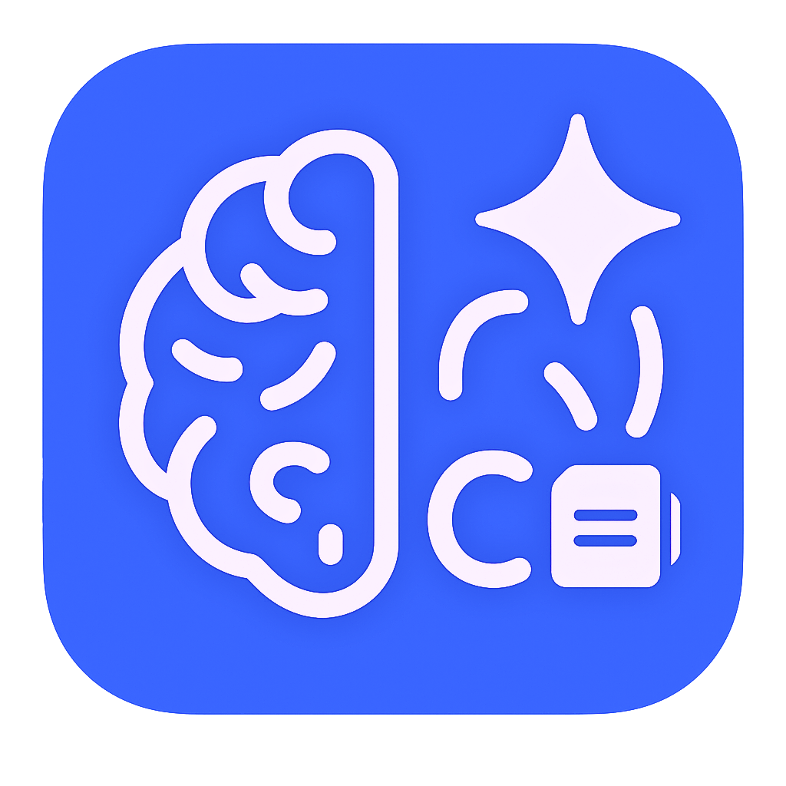

# SmartMeet AI

**SmartMeet AI** is a macOS productivity application that automatically summarizes your local Zoom meeting recordings using OpenAI's Whisper and GPT models.

---

  

<h2 align="center">Listen once. Focus on the meeting. Understand always.</h2>

  

---

## Features

- **Privacy-First**: User must manually grant access to the local `Zoom` folder for the app to function.
- **Automatic Detection**: When a Zoom meeting ends and the `.m4a` recording is saved to disk, SmartZoom starts processing automatically.
- **AI-Powered Summary**: The app transcribes the audio using Whisper and generates a human-like summary using GPT-4.
- **Highlight System**:
  - **Red dot** indicates a draft summary — user can still edit or regenerate.
  - **Saved summary** indicates finalized output stored in Database.
- **Minimal Interface**: Designed for focus — the main screen displays a simple list of recent meetings with timestamps, transcript, and summary side-by-side.

---

## Privacy and Permissions

Apple’s privacy rules prevent direct background access to the user's files. Therefore, the app:

1. Prompts the user to select the `Zoom` recordings folder on first launch.
2. Watches that folder for new subfolders created after each Zoom meeting.
3. Looks inside them for `.m4a` audio files that Zoom saves when local recording is enabled.
4. Once a new file is detected:
   - Shows a system notification: **“Your audio has been captured. Summary in progress.”**
   - Processes it using Whisper + GPT-4.
   - When ready, another notification is shown: **“Summary ready!”**

---

## Built With

- **Flutter** (macOS)
- **OpenAI Whisper** – for transcription
- **OpenAI GPT-4** – for summarization
- **Firebase** – for anonymous login & summary storage
- **Zoom folder watcher** – detects new `.m4a` files automatically

---

## Installation

This project is public on App Store (MACOS).

---

## Screenshots

---

## About Me

I built SmartMeet AI to save time and mental load after long meetings. It's a native macOS experience with AI under the hood — designed with privacy, clarity, and speed in mind.

